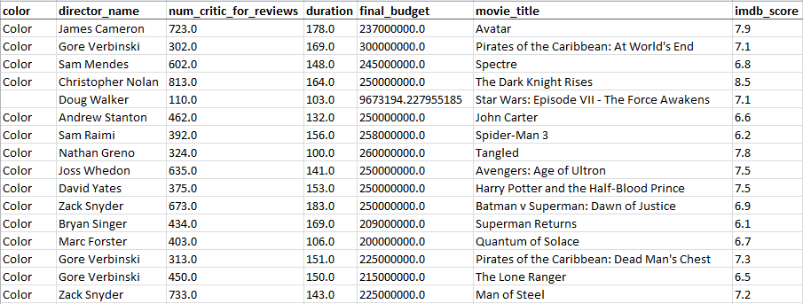
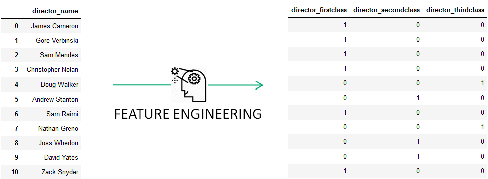

>(This is a doc template for your own project)

# IMDB Film Rating Prediction

## Table of contents
- [1. Objective](#1-objective)
- [2. Data pre-processing](#2-data-pre-processing)
    * [2.1 Data collection](#21-data-collection)
    * [2.2 Data exploration](#22-data-exploration)
    * [2.3 Data cleaning](#23-data-cleaning)
- [3. Feature Engineering](#3-feature-engineering)
    * [3.1 Creating new features](#31-creating-new-features)
- [4. Model Training](#4-model-training)
    * [4.1 Train and test split](#41-train-and-test-split)
    * [4.2 Algorithms and performance estimator](#42-algorithms-and-performance-estimator)
        + [4.2.1 Algorithms](#421-algorithms)
        + [4.2.2 Performance estimator](#422-performance-estimator)
- [5. Results](#5-results)

## 1. Objective
This project is an example of a classic **DataScience project**. The structure has been generated by the **Skeleton** provided in the **datalab_tools** kit. Once completed, the package is ready to be industrialized. You are free to look into it and change the contents for it to match your own DataScience project.

Now let's talk about the real thing.

Ever wondered if a movie was worth spending your precious time and hard-earned money on?

Well, worry not. This datalab's new package will let you know if a movie is worth watching on a scale of 1-10

## 2. Data pre-processing
### 2.1 Data collection
The original dataset comes from **Kaggle**, a web platform for predictive modelling and analytics competitions. Information about 5042 films has been collected from **IMDB**, the Internet Movie Database. 
(Basically, IMDB is like our "Allociné" but worldwide)
### 2.2 Data exploration
First things first ! Let's get an overview of the raw data :

The dataset contains 7 columns and 4917 rows.

  

- Information about the movie and the public opinion was collected.
- We have both categorical and numerical features.
- `imdb_score` is the target variable.

### 2.3 Data cleaning
**Data cleaning** allows you to deal with data suffering from a wide range of errors and inconsistencies.  The best way to go is to spot the anomalies and to determine which techniques you should apply in order to get your data cleaned. For this project, we used  imputation methods. 

Different techniques were used to replace the missing values such as the median or a fixed value.
We also had to drop the lines where the `director_name` was missing.

## 3. Feature Engineering
**Machine learning** works on a simple rule – if you put garbage in, you will only get garbage to come out. By garbage here, we mean noise in data.
After the cleaning process, we can now focus on the feature engineering.
### 3.1 Creating new features
Well-conceived new features can sometimes capture the important information in a dataset much more effectively than the original features.

No need to look into the dataset to know that the values of `director_name` columns is very disparate. 

We created 3 new features : `director_firstclass` (director who made more than 5 films), `director_secondclass` (director who made between 1 and 5 films), `director_thirdclass`  ( director who made only one film). Then we converted the categorical variables into indicator variables.

Others categorical variables just needed to be transformed into indicator variables. (e.g. `color`)

  

## 4. Model Training
### 4.1 Train and test split
The train and test split was done as follows :
- 60% train
- 40% test

### 4.2 Algorithms and performance estimator
#### 4.2.1 Algorithms
The score that we need to predict is a numerical value. Thus, the algorithm has to be a regression in order to get the exact predict value. We decided to apply a **random forest**.
#### 4.2.2 Performance estimator
The **MSE** (or **Mean Squared Error**) measures the average of the squares of the errors or deviations. It is often use as a quality estimator of regression algorithm's performance. Values closer to zero are better.

|Model                   |MSE Test Error|
|------------------------|--------------|
|Random Forest Regression|1.07          |

## 5. Results
Here are some tests that we made. Feel free to add your favorite film to our list.

|Film Name                            | Predict Score| Real Score|
|-------------------------------------| -------------| ----------|
|Pirates of Cariibean : At World's End| 7.11         | 7.1       |
|Iron Man 3                           | 7.37         | 7.2       |
|John Carter                          | 6.79         | 6.6       |
|Titanic                              | 7.63         | 7.7       |
